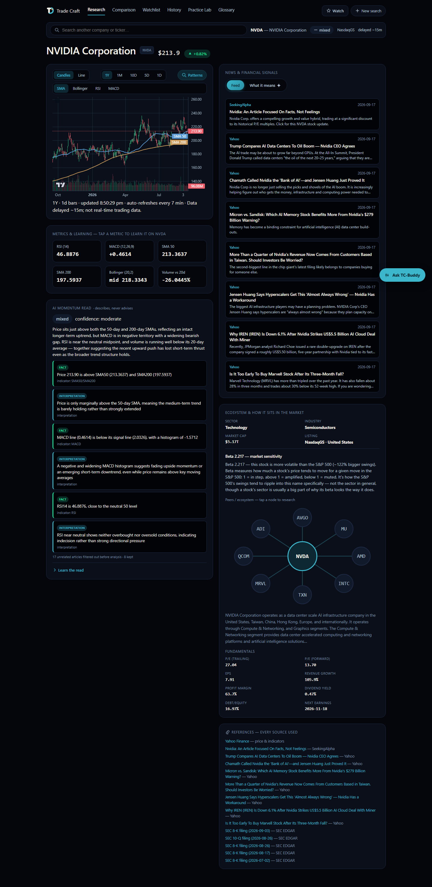
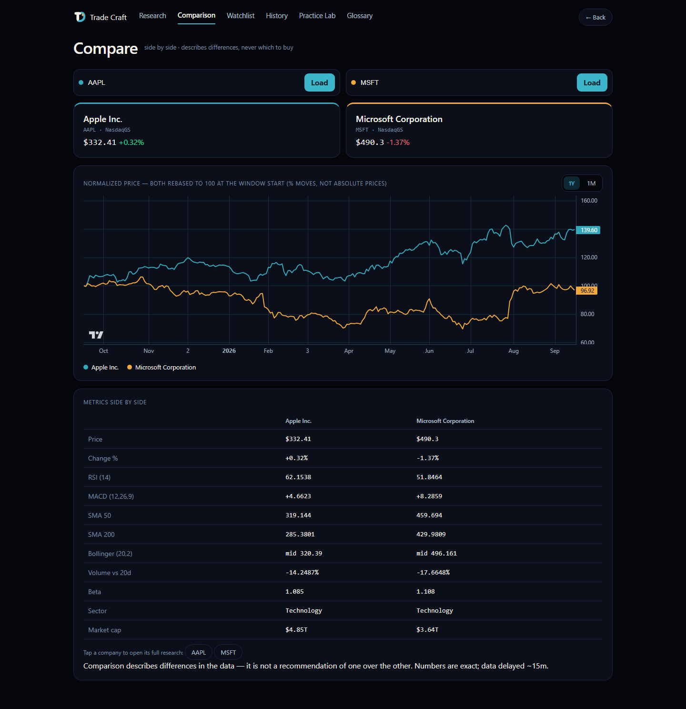
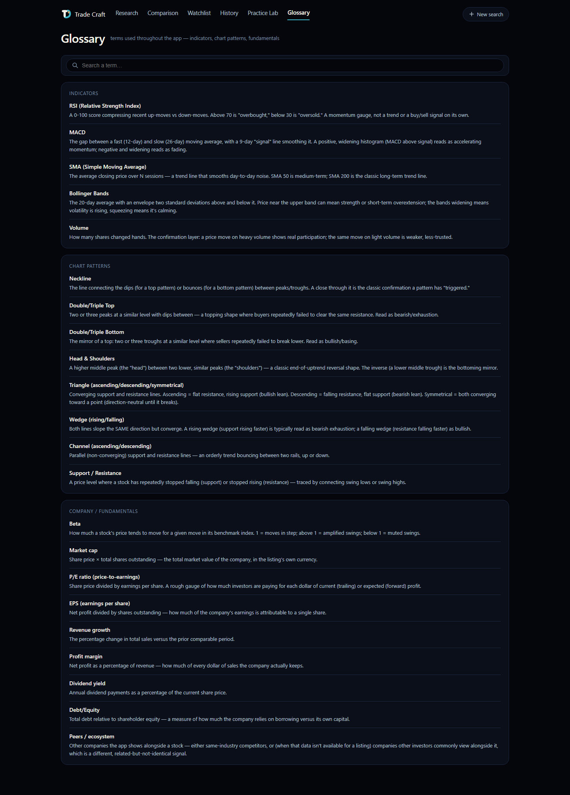
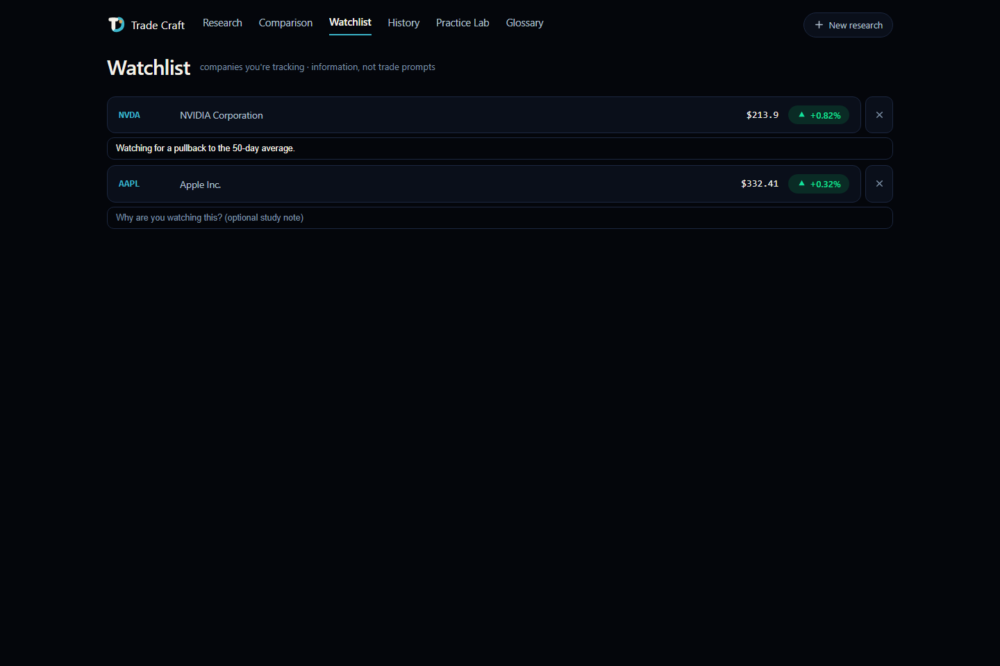
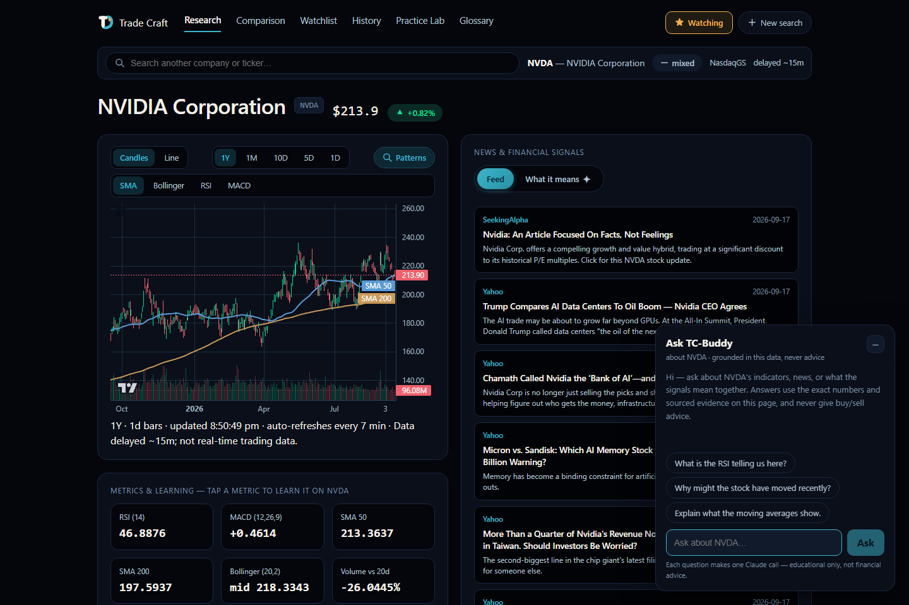

# Trade Craft

A personal stock-research **and learning** web app. Type a **company name** (any market) → Trade Craft pulls live prices, computes indicators, detects chart patterns, gathers news + filings + fundamentals, and **explains the momentum with sourced reasoning** — so you learn to read the market on real stocks, on any exchange in the world.

> **It never tells you to buy or sell.** Numbers are exact (deterministic code); every AI opinion is source-backed. It's a data-analytics + learning tool, not a signal generator. Data is delayed ~15 min.

**🔗 Live: [trade-craft-qdsw.onrender.com](https://trade-craft-qdsw.onrender.com)** — free tier, sleeps after ~15 min idle (first load after a nap takes ~30-60s to wake up). Bring your own Anthropic key for the AI features; everything else is free with no key.



## Features

- **Search by name, any market** — "samsung", "toyota", "reliance" → pick from the matches (US, China, Japan, Korea, Hong Kong, Singapore, India, Europe), ranked by listing quality so a thin OTC line never outranks the real company.
- **Live chart** — candlesticks or line, timeframes 1Y · 1M · 10D · 5D · 1D (intraday), auto-refreshes every 7 min. SMA 50/200 + Bollinger Bands overlay the price pane; RSI and MACD get their own panes below, with a crosshair OHLC legend.
- **Chart patterns** — reversals (double/triple top & bottom, head & shoulders) and trendline shapes (triangles, wedges, channels), scanned across the whole series and drawn on the chart with a plain-English lesson. A heuristic learning aid — never a signal.
- **Metrics + learning** — tap any indicator to learn what it means *on this stock, right now*.
- **AI momentum read** — bullish/bearish/mixed + confidence, synthesized from the indicators and news, every claim labeled Fact / Interpretation / Unknown and sourced.
- **News** — a free, deterministic headline feed (works with no AI key at all) plus an AI "what it means" inference layered on top.
- **Ecosystem & fundamentals** — sector, industry, beta (vs. the right regional index), market cap, P/E, EPS, revenue growth, margins, dividend yield, debt/equity, next earnings date, and a clickable peer graph.
- **Comparison** — two stocks side by side: normalized price chart (rebased to 100) + a full metrics table. Deterministic, no AI spend, describes differences without ever saying which to buy.
- **Watchlist** — track companies you're studying, each with an optional one-line note on *why*.
- **Practice Lab** — a simulated $100,000 paper portfolio + trade journal. Log a hypothetical buy/sell at the real live price with your own reasoning; realized P&L is computed exactly.
- **Glossary** — a searchable reference for every indicator, pattern, and fundamentals term used in the app.
- **Ask TC-Buddy** — a floating chat grounded in the exact data already on the page. Never gives advice.
- History, browser back/forward, and shareable `#TICKER` links throughout.

<p float="left">
  
  
</p>
<p float="left">
  
  
</p>

## Stack

- **Backend:** Python · FastAPI · yfinance · pandas · scipy · Anthropic (Claude). Deterministic services + AI agents.
- **Frontend:** React · Vite · Lightweight-Charts v5.

## Who pays for the AI features? (BYOK)

Trade Craft is **bring-your-own-key**: the charts, indicators, news, patterns, and ecosystem data are free for anyone with no key at all. For the AI features (the momentum read, Ask TC-Buddy), each visitor pastes their **own** Anthropic API key once — it's saved only in their browser and billed to their own account, never the app owner's. That means a shared link carries **zero cost risk** to whoever's hosting it.

---

## Setup

### 0. Prerequisites
- **Python 3.11+** and **Node 18+**.
- A free **Finnhub key** ([finnhub.io](https://finnhub.io/register)) for US company news (non-US markets get news from keyless fallbacks regardless).
- Optionally, your own **Claude API key** ([console.anthropic.com](https://console.anthropic.com/settings/keys)) if you want to test the AI features locally without pasting a key into the browser every time — see [Config](#config) below.

### 1. Backend
```bash
cd backend
python -m venv .venv
# Windows:
.venv/Scripts/python.exe -m pip install -r requirements.txt
# macOS/Linux:
# source .venv/bin/activate && pip install -r requirements.txt
```

### 2. Environment
Copy the template to `.env` in the **project root**:
```bash
cp .env.example .env
```
```
TRADE101_NEWS_KEY=...                 # free Finnhub key (news)
# TRADE101_ANALYSIS_KEY=sk-ant-...    # OPTIONAL local-dev fallback only —
                                       # do NOT set this on a shared/deployed host
```
The app runs without any keys at all — you just get prompted for your own Claude key in the browser to use the AI features (chart, indicators, patterns, news, ecosystem, fundamentals all work with zero keys).

### 3. Frontend
```bash
cd frontend
npm install
```

---

## Run

Open **two terminals**:

**Backend:**
```bash
cd backend
.venv/Scripts/python.exe -m uvicorn app:app --reload --port 8000   # Windows
# uvicorn app:app --reload --port 8000                              # macOS/Linux
```

**Frontend:**
```bash
cd frontend
npm run dev
```
Open **http://127.0.0.1:5173**.

> **Windows / PowerShell:** if `npm` is blocked with *"running scripts is disabled"*, either run `npm.cmd run dev`, or once: `Set-ExecutionPolicy -Scope CurrentUser -ExecutionPolicy RemoteSigned`.

## Test
```bash
cd backend
.venv/Scripts/python.exe -m pytest -q

cd frontend
npm run test
```

## Project layout
```
backend/    FastAPI app, services (marketdata, indicators, patterns, news,
            company, search, evidence, safe, cache), agents (orchestrator,
            analysis, chat, llm), tests
frontend/   React + Vite app — components (Welcome, Research, PriceChart,
            Compare, Watchlist, PracticeLab, Glossary, AskClaude, ApiKeyGate,
            ...), lib (history, watchlist, practiceLab, glossary, apiKey,
            currency), tests
docs/       design spec, implementation plan, deploy guide, audit history
```

## Deploy

Single-service (one FastAPI process serves both the API and the built React app) — see [`docs/DEPLOY.md`](docs/DEPLOY.md) for Render setup (recommended, free) or a Dockerfile for other hosts. Because of BYOK, **there's nothing to configure for cost-safety before sharing the link** — deploy it, share it.

## Disclaimer
Historical/technical analysis and educational explanations only — **not financial advice**, not a recommendation to trade. Data is delayed. Chart-pattern detection is a heuristic aid that fails often. Do your own research.
